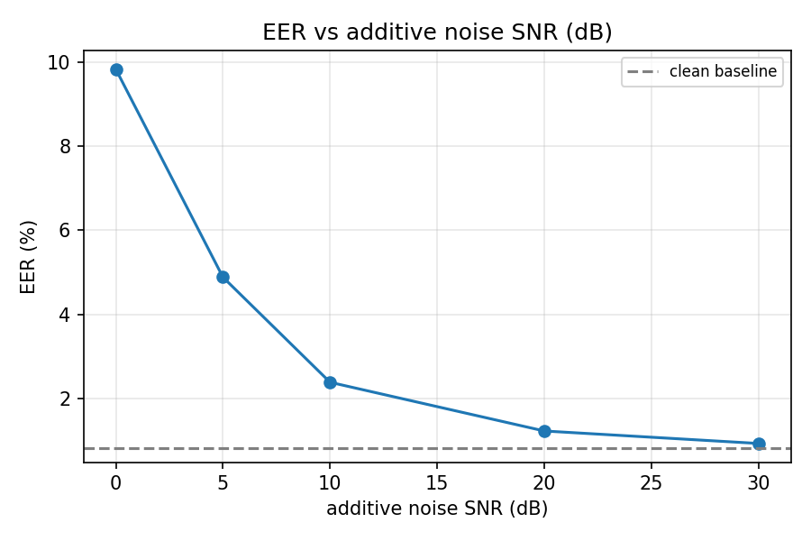
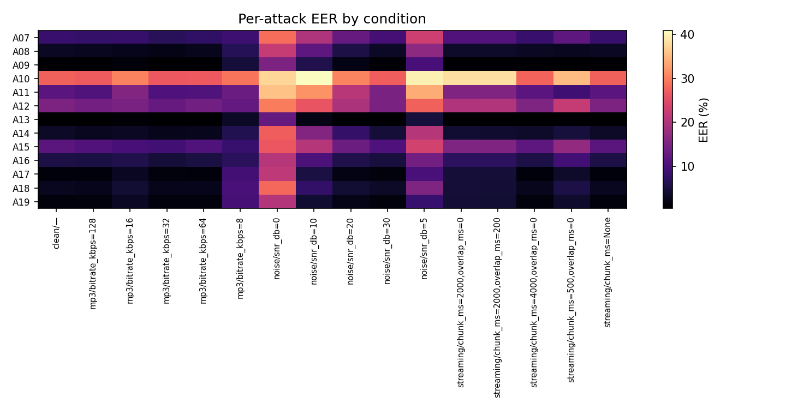
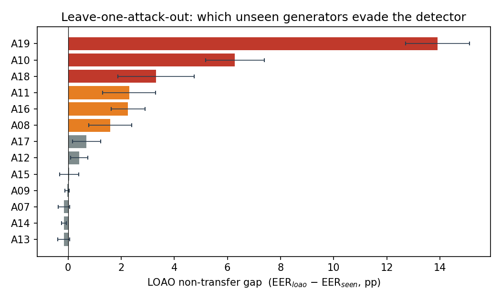
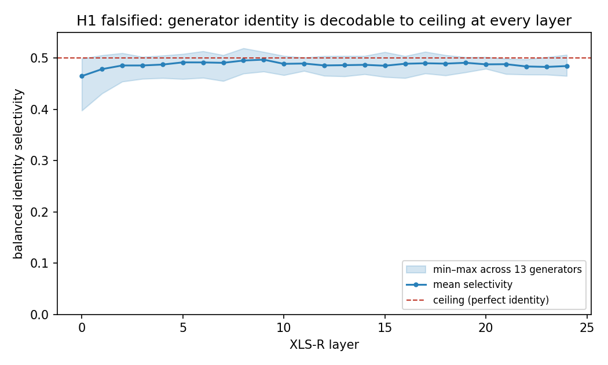
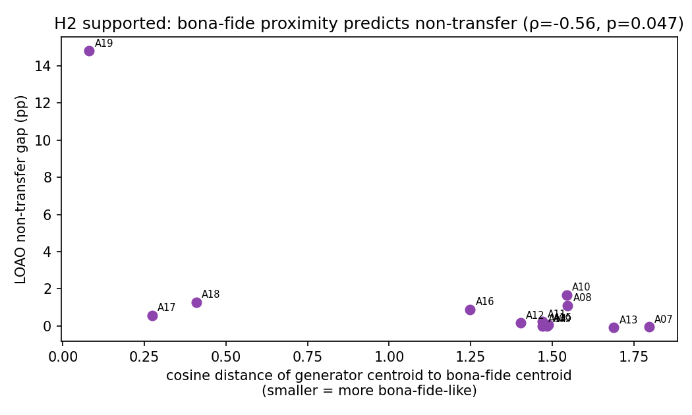
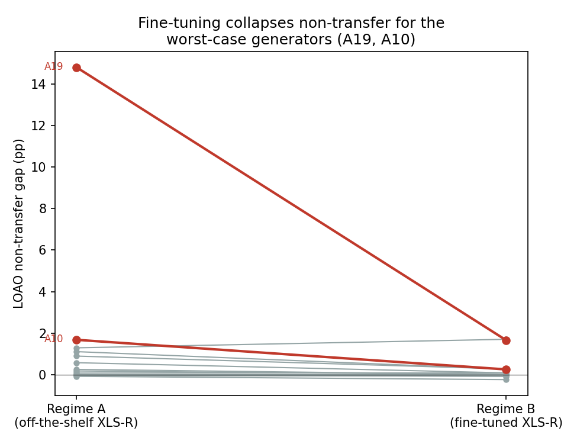

# Audio Deepfake Detection in the Real World: Robustness & Generalization

*ASVspoof 2021 LA · pretrained SSL countermeasure · a robustness evaluation paired
with a falsification-driven study of why detectors fail to generalize.*

A deployed audio-deepfake detector faces two things its training set never showed
it: **degraded channels** and **unseen generators**. This report measures both —
empirically *where* a strong pretrained detector breaks (Part 1), and
representationally *why* it fails to generalize (Part 2).

> 🚧 **Provisional (work in progress).** Part 1's *absolute* EERs are being re-run
> after a padding fix — the clean EER below was inflated by a zero- vs. repeat-pad
> train/test mismatch (the published baseline for this model is 0.82%). The *relative*
> Part 1 findings and all of Part 2 are unaffected. See the README Status section.

## TL;DR

- **Clean baseline (full 165,102-trial eval): EER 9.73%, AUC 0.967.**
- **Noise, not compression, is the deployment failure axis.** MP3 is essentially
  free (even mildly *helpful* down to 32 kbps); additive noise drives EER from
  9.7% → **25.7% at 0 dB**. Streaming needs **≥4 s of context** (EER rises to 12.5% by 2 s).
- **A10 (Tacotron2 + WaveRNN) is the standing blind spot:** 27.5% EER even on the
  clean set while most attacks sit near 1–5%.
- **Generalization (Part 2):** detectors fail to transfer to specific *unseen*
  generators — **A19 leave-one-attack-out gap +13.9 pp** (EER 3.4% → 17.3%).
- **H1 falsified, robustly.** Generator identity is near-perfectly linearly
  decodable from the frozen encoder at *every one of 25 layers* — so its
  (non-existent) variation cannot explain differential non-transfer.
- **H2 supported.** Non-transfer is a **boundary-geometry** effect: generators
  whose embeddings sit close to the bona-fide manifold are the ones that evade an
  unfamiliar detector (cos-distance-to-bona vs gap, ρ = −0.60, p = 0.029).
- **Fine-tuning the encoder** relocates the worst generator off the bona-fide
  manifold and **collapses its gap (A19 13.9 → 4.6 pp)** — a clean mechanism case
  study (population-level causality remains untested; see Limitations).

## Setup

- **Data.** ASVspoof 2021 LA evaluation set; the official CM key gives 165,102
  scored trials over attacks **A07–A19** (2021 reuses the 2019 eval attacks;
  label 1 = bona fide).
- **Baseline detector.** **SSL_Anti-spoofing** (XLS-R 300M front-end + AASIST
  back-end, Tak et al., Interspeech 2022), loaded **fairseq-free** via an exact
  fairseq→HuggingFace weight remap (`src/ssl_aasist.py`; 0 missing / 0 unexpected
  keys). *Note: the proposal's `lab260/AASIST3` checkpoint is degenerate (~63% EER,
  scores everything bona fide) across every public mirror, so it was dropped.*
- **Metrics.** Interpolated EER, **normalized** min-DCF, AUC, per-attack EER.
  Score convention throughout: **higher = more bona fide**.
- **Scale.** Part 1 runs the **full** eval set. Part 2's representational study
  runs on a stratified **7,987-utterance** subset (812 bona fide / 7,175 spoof),
  with frozen per-layer XLS-R embeddings cached once.

## Part 1 — Robustness under real-world degradation

**Clean baseline.** EER **9.73%**, AUC **0.967**, normalized min-DCF 0.66 — a
credible, non-degenerate operating point on the full eval set.

**Degradation sweep** (`src/degradations.py`, batched bf16 scoring):

| Axis | Finding |
|---|---|
| **MP3** (8–128 kbps) | Negligible; EER *drops* to **8.5%** at 32 kbps, only rising to 10.0% at 8 kbps. Lossy compression is not the threat. |
| **Additive noise** (0–30 dB) | The failure axis: 10.2% (30 dB) → 18.0% (10 dB) → **25.7% (0 dB)**, a +16 pp swing; min-DCF saturates to ~1.0 by 10 dB. |
| **Streaming** (chunked) | 4 s chunks are free (9.76%); EER jumps to **12.5% at 2 s** and min-DCF saturates — the model needs ≥4 s of context. |
| **Native codec** (LA's own) | Modest: PSTN worst at **8.2%** vs ~6.5–7.0% for a-law/µ-law/Opus/GSM. |



**Per-attack failure analysis (clean).** The detector is near-perfect on several
attacks (A09, A13 ≈ 0.5%) but has a hard blind spot: **A10 (Tacotron2 + WaveRNN)
at 27.5%**, with A12 (15%) and A11/A15 (~11.5%) also weak. This is a *seen-attack*
weakness — A10 is hard even though the model family trained on its category.



## Part 2 — Why detectors fail to generalize

Part 1 asks where the *deployed* detector breaks. Part 2 asks a representational
question on the frozen XLS-R embedding: **what makes a detector fail to transfer
to an unseen generator?** We use leave-one-attack-out (LOAO): for each attack `f`,
compare a linear head trained *with* `f` against one trained on all attacks
*except* `f`, both evaluated on held-out `f` vs bona fide. The
**non-transfer gap** = EER_loao − EER_seen.

**The finding.** Most generators transfer fine (gap ≈ 0), but a few fail sharply —
**A19: gap +13.9 pp (3.4% → 17.3%)** and **A10: +6.3 pp**. The detector simply
does not recognize an unseen A19 as spoof.



**H1 (the pre-registered hypothesis): does probe-recoverable generator *identity*
predict non-transfer? Falsified.** The hypothesis was that generators whose
identity is more strongly linearly encoded would be the ones that fail to
generalize. Instead, generator identity is decodable to **ceiling** (balanced
one-vs-rest selectivity ≈ 0.49 of a 0.5 max) at **every one of the 25 layers**,
with near-zero variance across generators. A constant cannot predict a variable:
no layer's selectivity correlates with the gap (all p ≥ 0.12). The failure isn't
*absence* of identity in the representation — it's *saturation*.



**H2 (the replacement hypothesis): is it boundary geometry? Supported.** A
detector trained on {bona fide + seen spoof} draws a boundary; an unseen generator
transfers iff it lands on the spoof side. So non-transfer should track how close a
generator sits to the **bona-fide manifold** relative to the other generators.
Across the 13 attacks (layer 9):

| Geometric predictor | ρ vs gap | p |
|---|---|---|
| cosine distance to bona-fide centroid (closer ⇒ higher gap) | **−0.60** | **0.029** |
| projection onto bona↔seen-spoof axis (bona side ⇒ higher gap) | **+0.59** | **0.033** |
| Euclidean distance to bona centroid | −0.54 | 0.055 |
| distance to nearest *other* spoof (isolation) | +0.03 | 0.91 (null) |

Every bona-proximity measure points the same way; **isolation among spoofs does
nothing**, exactly as the boundary account predicts. **A19 is the exemplar:** its
centroid sits ~3.5× closer to bona fide than the next-closest generator (~14× the
typical one), and a k-NN that
never saw it labels **51% of its samples bona fide**.



**Regime B — fine-tuning as a perturbation of the geometry.** Repeating the study
with the *fine-tuned* XLS-R front-end (from the SSL_Anti-spoofing checkpoint)
instead of the off-the-shelf encoder shrinks non-transfer overall (mean gap
2.33 → 1.45 pp) and **dramatically for the worst case: A19 13.9 → 4.6 pp**.
Mechanistically, fine-tuning moved A19's centroid from cos-distance **0.095 → 1.17**
off the bona-fide manifold — the gap collapsed in step. This is a compelling
**case study** for the geometry mechanism.



## Limitations (read these)

- **Part 2 is correlational on n = 13 attacks.** The H2 result is two
  bona-proximity predictors at p ≈ 0.03 with consistent directions; treat as
  strong-suggestive, not definitive.
- **The Regime-A→B contrast is a case study, not population proof.** The
  cross-regime test Spearman(Δcos, Δgap) is **null** (ρ = −0.21, p = 0.49): most
  attacks had ~0 gap to begin with (no dynamic range), and **A10 is a
  counter-example** — fine-tuning helped it while moving it *toward* bona, because
  A10's failure is the neural-TTS blind spot (a different mechanism), not geometry.
- **Two different lenses.** Part 1's per-attack EER is the *deployed nonlinear*
  AASIST detector; Part 2's LOAO uses a *linear* head on mean-pooled frozen
  embeddings. A10 is hard in both; A19 is easy-when-seen but the worst
  *non-transfer* — these are not contradictions, they measure different things.
- min-DCF is normalized; Part 2 uses an 8k subset; attacks are eval-only (A07–A19).

## Reproduce

```bash
python3.12 -m venv .venv && source .venv/bin/activate && pip install -r requirements.txt
# Part 1
python -m src.evaluate --full                       # degradation sweep -> results/*_full.csv
python scripts/make_figures.py results/per_attack_eer_full.csv
# Part 2
python -m scripts.cache_embeddings --subset 8000    # frozen XLS-R embeddings (GPU)
python -m scripts.loao_per_attack --emb-dir results/embeddings --out results/loao_per_attack.csv
python -m scripts.layer_sweep_selectivity           # H1
python -m scripts.geometry_h2                        # H2
python -m scripts.cache_embeddings_ft --subset 8000 # Regime B (fine-tuned encoder)
python -m scripts.compare_regimes
python -m scripts.make_part2_figures
```
